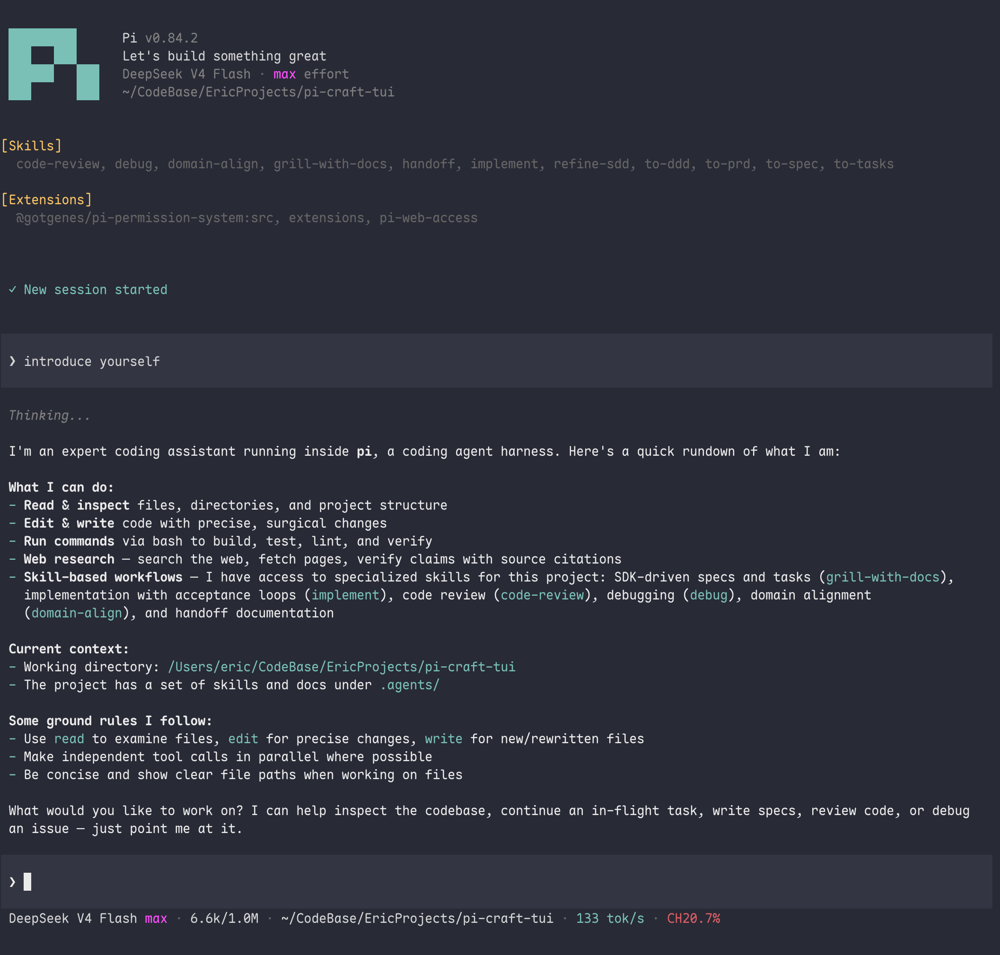

# pi-packages

[English](./README.md) | 简体中文

适用于 [Pi](https://pi.dev/) 的模块化扩展插件合集。

## 包含的 Packages

- **`pi-craft-tui`** (`src/pi-craft-tui`) —— Claude Code 风格 Header、Codex 风格输入区与单行 Footer 状态栏。
- **`pi-simple-permission`** (`src/pi-simple-permission`) —— 轻量权限拦截与守护扩展。

## 安装

先用 `pi config` 关掉其他冲突的扩展（如其他 TUI）。

```bash
# 1. 克隆仓库
git clone https://github.com/flyeric0212/pi-packages.git /path/to/pi-packages

# 2. 安装扩展
pi install /path/to/pi-packages/src/pi-craft-tui
pi install /path/to/pi-packages/src/pi-simple-permission
```

然后新开一个 Pi 会话，或执行 `/reload`。

## pi-craft-tui 功能介绍



**界面**

- **Header** —— 新进程播放一次 π logo 动画，展示版本、标语、模型、推理强度和项目目录
- **Editor** —— Codex 风格填充输入框，粗体 `❯`；历史消息保留同一标记；`!` 开头切换 bash 模式配色
- **Footer** —— 单行：`model high · 126k/400k · cwd (main) · tok/s · CH87.3%`；其他扩展的状态显示在上一行

**交互**

- **`/clear` 与 `/cls`** —— 仅视觉填满视口；不触碰会话
- **`/stats`** —— 会话统计卡：token 汇总（↑↓R/W Σ）、缓存命中、轮次与时长
- **技能短命令** —— `/name` 运行已加载的 skill（等同 `/skill:name`）；补全菜单显示短名
- **斜杠命令** —— 行首命令名用主题强调色；Enter 在部分匹配时只补全，打全了才提交

## 设计原则

- **Pi 原生优先。** 只用公共 API；原生组件只包装、组合，不重造；不接管 Pi 或其他扩展拥有的槽位、命令和工具。
- **保持兼容。** 只依赖稳定公共接口，安装完全可逆，每次 Pi 升级后重新核对。
- **开销趋近于零。** 格式化保持纯函数并复用计算结果，高频路径节流，会话资源懒构建、全清理；确属必要的开销也取最小实现并注明取舍。

## License

[MIT](./LICENSE)
